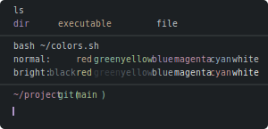

# Base16 Warp Themes

| Theme name                                                                       | Preview                                                                     |
| -------------------------------------------------------------------------------- | --------------------------------------------------------------------------- |
| **[Base16 Ashes](base16_ashes.yaml)**:                                           |                       |
| **[Base16 Atelier Cave](base16_atelier_cave.yaml)**:                             |                |
| **[Base16 Atelier Plateau](base16_atelier_plateau.yaml)**:                       |             |
| **[Base16 Codeschool](base16_codeschool.yaml)**:                                 |                  |
| **[Base16 Darkviolet](base16_darkviolet.yaml)**:                                 |                  |
| **[Base16 Icy](base16_icy.yaml)**:                                               |                         |
| **[Base16 Nebula](base16_nebula.yaml)**:                                         |                      |
| **[Base16 Nord](base16_nord.yaml)**:                                             |                        |
| **[Base16 Porple](base16_porple.yaml)**:                                         |                      |
| **[Base16 Xcode Dusk](base16_xcode_dusk.yaml)**:                                 |                  |
